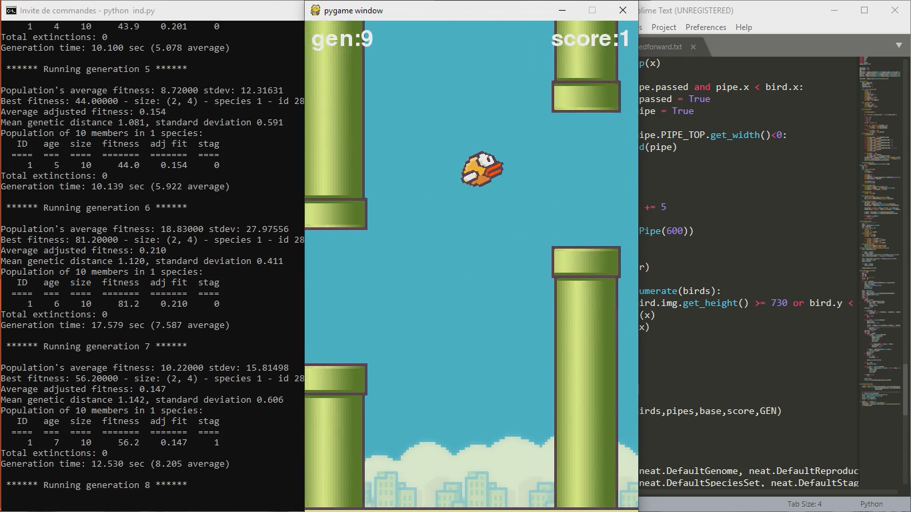

# flbird_ridabenbouziane

## Titre

## Overview
This project follows the description of the Deep Q Learning algorithm.
Q-Network : It is a convolutional neural network, trained with a variant of Q-learning, whose input is raw pixels and whose output is a value function estimating future rewards.

## Installation Dependencies:
* Python 2.7 or 3
* TensorFlow 0.7
* pygame
* OpenCV-Python
## References

https://www.youtube.com/watch?v=MMxFDaIOHsE&t=15s

Mnih Volodymyr, Koray Kavukcuoglu, David Silver, Andrei A. Rusu, Joel Veness, Marc G. Bellemare, Alex Graves, Martin Riedmiller, Andreas K. Fidjeland, Georg Ostrovski, Stig Petersen, Charles Beattie, Amir Sadik, Ioannis Antonoglou, Helen King, Dharshan Kumaran, Daan Wierstra, Shane Legg, and Demis Hassabis. **Human-level Control through Deep Reinforcement Learning**. Nature, 529-33, 2015.

Volodymyr Mnih, Koray Kavukcuoglu, David Silver, Alex Graves, Ioannis Antonoglou, Daan Wierstra, and Martin Riedmiller. **Playing Atari with Deep Reinforcement Learning**. NIPS, Deep Learning workshop

Kevin Chen. **Deep Reinforcement Learning for Flappy Bird** [Report](http://cs229.stanford.edu/proj2015/362_report.pdf) | [Youtube result](https://youtu.be/9WKBzTUsPKc)

ridabenbouziane@2019
